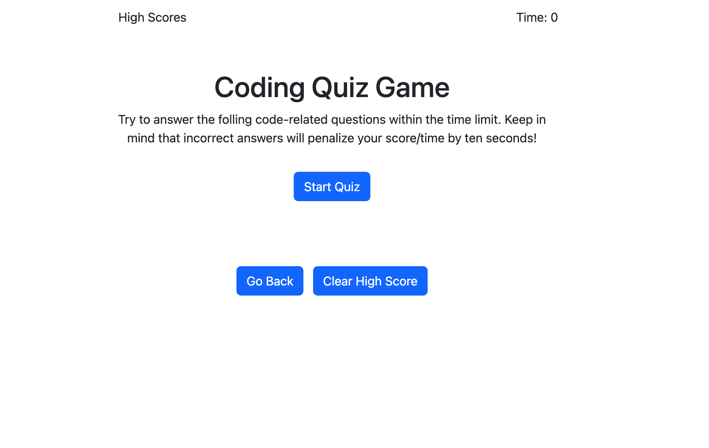
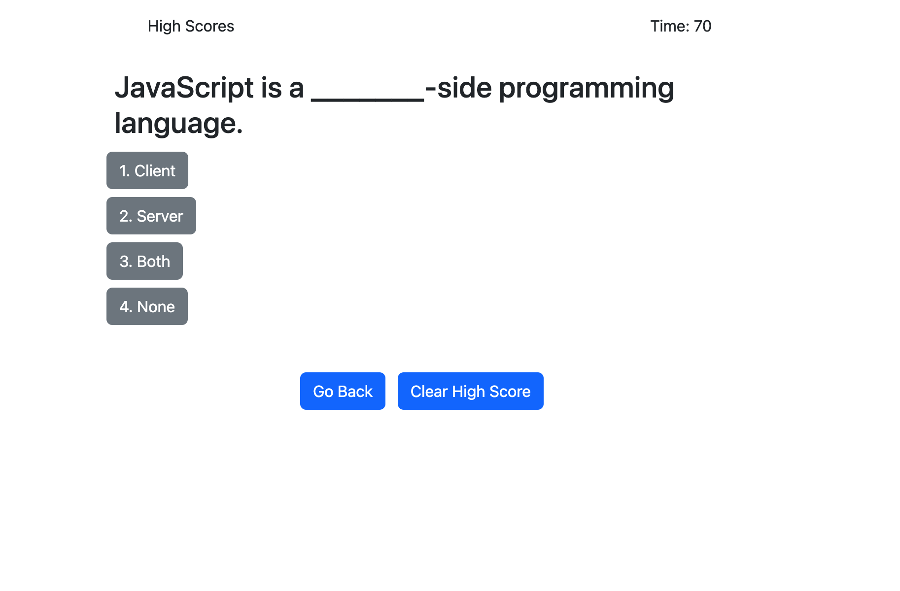
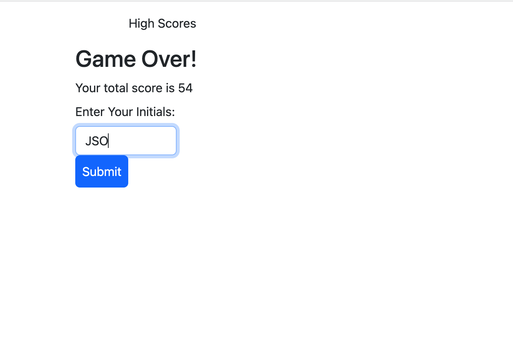

# JavaScript Code Quiz Game

Test you JavaScript knowledge and see if you can get the high score.

It's a race against the clock.

Layout and content were built using HTML, CSS, JavaScript & Bootstrap using VS Code.

## JavaScript Code Website Screen Shots

## Website Function:

* When you click the start button then a countdown timer starts and you are presented with your first question.

* When you answer a question incorrectly you will penalized 10 seconds.

* When all questions are answered or timer has expired then the game is over.

* You can then save your initials and score.

